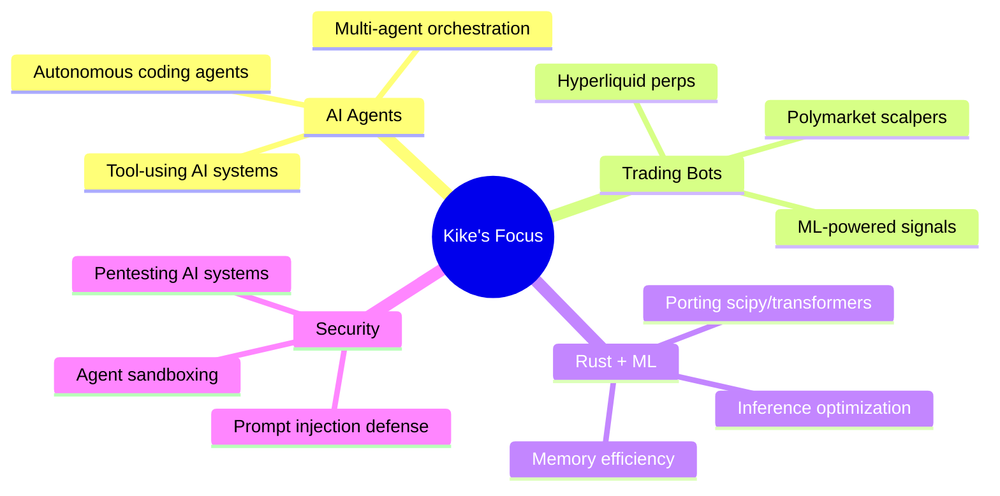

<div align="center">

# 👨‍💻 Kike // erscoder

[](https://twitter.com/erscoder41567)
[](https://github.com/erscoder)


**Full-Stack Engineer** • **AI Agent Developer** • **Crypto Trading Bot Builder**

</div>

---

## 🚀 About Me

Building autonomous systems that trade 24/7 and ship code while I sleep.

- 🦀 Working on **[rustml](https://github.com/erscoder/rustml)** - Porting Python ML libs to Rust
- 🤖 Creating **AI agent teams** for automated software development
- 📈 Running **algorithmic trading bots** on Polymarket & Hyperliquid
- 🔐 Security research for **autonomous AI agents**

```typescript
const kike = {
  location: "Spain 🇪🇸",
  languages: ["TypeScript", "Rust", "Python", "JavaScript"],
  focus: ["AI Agents", "Algorithmic Trading", "DeFi", "Security"],
  currentlyLearning: "Advanced Rust + ML inference optimization",
  funFact: "My bots trade more than I sleep"
};
```

---

## 🛠️ Tech Stack

<div align="center">

### Languages


### Frontend


### Backend & Database


### AI & ML


### DevOps & Tools


### Crypto & Web3


</div>

---

## 📊 GitHub Stats

<div align="center">


</div>

<div align="center">

[](https://git.io/streak-stats)

</div>

<div align="center">


</div>

---

## 🏆 GitHub Trophies

<div align="center">

[](https://github.com/ryo-ma/github-profile-trophy)

</div>

---

## 🔥 Featured Projects

<table>
<tr>
<td width="50%">

### 🦀 [rustml](https://github.com/erscoder/rustml)
**Rust + Machine Learning**

Porting Python ML libraries to Rust for 10x faster inference and 80% less RAM usage. Because Python had its rise, now Rust will have its ATH.


</td>
<td width="50%">

### 📈 [HyperSignals](https://github.com/erscoder/hypersignals-landing)
**Crypto Trading Platform**

Real-time trading signals & copy-trading for perpetual futures. Live on Hyperliquid with automated execution.


</td>
</tr>
<tr>
<td width="50%">

### 🎯 [CrewBoard](https://github.com/erscoder/crewboard-landing)
**AI Agent Task Management**

Kanban board for coordinating multiple autonomous AI agents on complex projects. Think JIRA meets AGI.


</td>
<td width="50%">

### 🛡️ [ClawdBot Security](https://github.com/erscoder/clawdbot-defense-skills)
**AI Agent Security**

Defense skills against prompt injection, secret leakage, and unsafe automation for OpenClaw agents.


</td>
</tr>
</table>

---

## 💡 What I'm Working On



---

## 📈 Contribution Activity

<!--START_SECTION:activity-->
<!--END_SECTION:activity-->

---

## 🎯 2026 Goals

- [ ] Ship **rustml-scipy** (100+ functions ported)
- [ ] Reach **$10K/month** with automated trading bots
- [ ] Build **multi-agent system** for autonomous SaaS development
- [ ] Contribute to **3 major open-source** Rust projects
- [ ] Speak at **Rust + ML conference**

---

## 📫 Let's Connect

<div align="center">

[](https://twitter.com/erscoder41567)
[](mailto:erscoder@gmail.com)
[](https://erscoder.com)

</div>

---

<div align="center">

### 💭 Random Dev Quote


</div>

<div align="center">

**✨ "Building the future of autonomous systems, one commit at a time." ✨**

<img src="https://capsule-render.vercel.app/api?type=waving&color=gradient&height=100&
